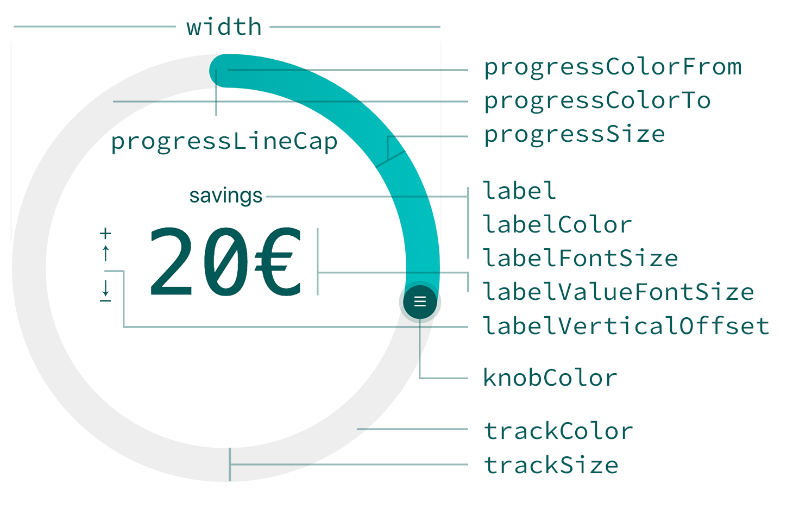

# react-circular-slider

 

A highly customizable circular slider with no dependencies. See some [live demos here!](https://fseehawer.github.io/react-circular-slider/)



## install

```
npm install @fseehawer/react-circular-slider
```

## example

```javascript
import React from 'react';
import CircularSlider from '@fseehawer/react-circular-slider';

const App = () => {
    return (
        <CircularSlider
            onChange={ value => { console.log(value); } }
        />
    )
};

export default App;
```

Use min and max props to define the range of numbers. Use prependToValue/appendToValue if you want to prepend/append e.g. "$" or "°" to the value. Or simply use the data prop and pass any number or string sequence as an array to be spread in 360°. See some [live demos here!](https://fseehawer.github.io/react-circular-slider/)

```javascript
import React from 'react';
import CircularSlider from '@fseehawer/react-circular-slider';

const App = () => {
    return (
        <CircularSlider
            label="savings"
            labelColor="#005a58"
            knobColor="#005a58"
            progressColorFrom="#00bfbd"
            progressColorTo="#009c9a"
            progressSize={24}
            trackColor="#eeeeee"
            trackSize={24}
            data={["1€","2€"]} //...
            dataIndex={10}
            onChange={ value => { console.log(value); } }
        />
    )
};

export default App;
```

## Props

prop                 | type   | default       | Affects
---------------------|--------|---------------|--------
width                | number | 280           | width of the slider
direction            | number | 1             | clockwise (**1**) or anticlockwise (**-1**)
min                  | number | 0             | smallest value
max                  | number | 360           | largest value
data                 | array  | []            | array of data to be spread in 360°
dataIndex            | number | 0             | initially place knob at a certain value in the array
knobColor            | string | #4e63ea       | knob color
knobSize             | number | 32            | knob size
hideKnob             | boolean| false         | hide knob
knobDraggable        | boolean| true          | knob not draggable
knobPosition         | string | top           | knob's 0 position to be **top**, **right**, **bottom** or **left**
label                | string | ANGLE         | label
labelColor           | string | #272b77       | label and value color
labelBottom          | boolean| false         | label position at bottom
labelFontSize        | string | 1rem          | label font-size
valueFontSize        | string | 4rem          | label value font-size
appendToValue        | string | ''            | append character to value
prependToValue       | string | ''            | prepend character to value
renderLabelValue     | jsx    | null          | add custom jsx code for the labels and styles
verticalOffset       | string | 2rem          | vertical offset of the label and value
hideLabelValue       | boolean| false         | hide label and value
progressColorFrom    | string | #80C3F3       | progress track gradient start color
progressColorTo      | string | #4990E2       | progress track gradient end color
progressSize         | number | 8             | progress track size
progressLineCap      | string | round         | progress track cap to be **round** or **flat**
trackColor           | string | #DDDEFB       | background track color
trackSize            | number | 8             | background track size
onChange             | func   | value => {}   | returns label value


## license

[MIT License](https://opensource.org/licenses/MIT)
